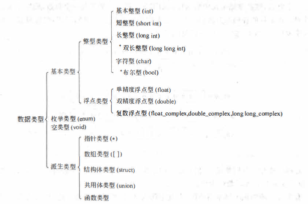
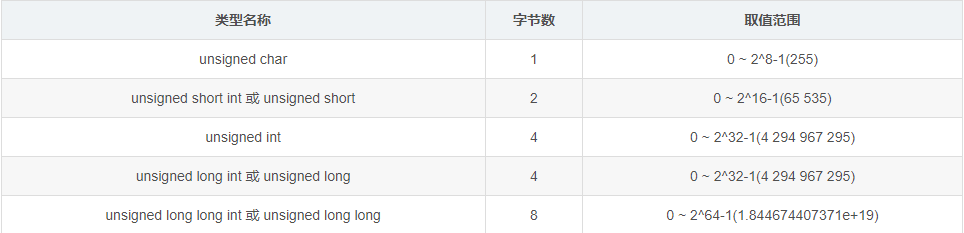
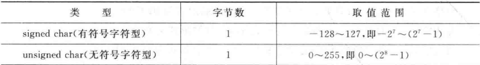
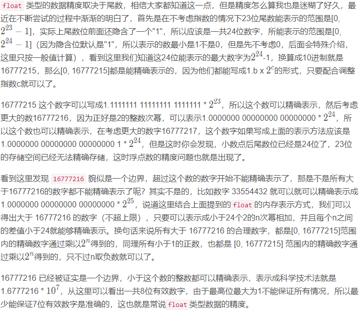

# C程序设计

## 基本流程

1. 编辑生成源文件、头文件（形式：ASCⅡ代码，后缀为.C），可以不包含主函数、单独作为一个C的程序文件被包含到其他程序中，可以通过#include来引用不同源文件中的函数，每一个源文件都可以被单独编译；
2. 编译生成目标文件（.obj/.o），通过编译器（能检查语法错误和简单的语义错误），计算机只能处理二进制的目标程序，经过编译后C语句被转换为若干个机器指令，且语句的类型、格式能决定机器指令的条数（声明部分不属于C语句、不产生机器指令）；
3. 函数库文件进行链接生成可执行程序（.exe）；
4. 可执行文件进行测试。
5. 简单程序设计步骤：确定数据结构、确定算法、编码、调试、整理文档。

# c语言的结构

## 1.程序的构成，MAIN函数和其他函数；

一个C语言程序的开发过程包括**编辑**，**编译**，**连接**，**运行**

### （1）**一个程序由一个或多个源程序文件组成**。

 一个规模**较小**的程序，往往只包括一个源程序文件，一个源程序文件中可以包括多个函数，但是只能有一个主函数（main函数）

①**预处理指令**。如include <stdio. h> (还有一些其他预处理指令，如# define等）。

②全局声明：即在函数之外进行的数据声明。例如可以把例1.2程序中的"int a, b,sum;"放到main函数的前面．这就是全局声明，在**函数外面**声明的变量称为**全局变量**。如果是在**程序开头**（定义函数之前）声明的变量，则在整个**源程序文件范围内有效**。在函数中声明的变量是**局部变量**，只在**函数范围内有效**。

③函数定义：指定每个函数的功能。在调用这些函数时，回完成函数定义中指定的功能。

程序总是从main函数开始执行的，而不论main函数在整个程序中位置如何。

### （2）函数时C程序的只要组成部分

程序几乎全部工作都是由**各个函数**分别完成的，函数时C程序的基本单位，在设计良好的程序中，每个函数都用来实现**一个或几个特定的功能**，编写C程序的工作就是**编写一个个函数**。

一个C语言程序是由**一个或多个函数**组成的，其中必须包含一个**main函数**

一个**小**程序只包含**一个**源程序文件，一个**源程序**包含**若干个函数**

当程序**规模较大**时，可以使一个程序包含**若干个源程序文件**，每个**源程序**包含**若干个函数**

在进行**编译**时，是以**源程序文件**为对象进行的。在**分别**对**各个源程序文件**进行**编译**并得到**目标程序**后，再将这些**目标程序**连接成一个**统一**的**二进制可执行文件**。

C语言这种特点使得**容易**实现**模块化**。

### （3）一个函数包括两个部分

①**函数首部**

即函数的一行，包括

| 函数属性 | 函数类型 | 函数名 | **参数类型（形式参数）** | **函数参数名** |
| ---------- | ------------ | ------------ | -------------- | ------------------------ |
| **static**(内部) | int   | max | （**int** | **a**) |


| 函数属性           | 函数类型 | **函数名** | **参数类型（形式参数）** | **函数参数名** |
| ------------------ | -------- | ---------- | ------------------------ | -------------- |
| **extern**（外部） | **int**  | **max**    | (**void**)               |                |


②**函数体**

即函数**首部以下**的部分，若函数有多层花括号，则**最外面**的一个对时函数体的范围


而函数体中分为两部分

（1）声明部分

例如 :

```C
int a,b,c
```

（2）执行部分

```C
a=1;
b=++a;
```

函数体**可以**既**没有**声明部分也没有执行部分

程序总是从**main函数**开始执行的

程序中要求计算机的操作是由函数中的**C语句**完成的

每个数据声明和语句**最后**必须有一个**分号**

C语言**本身不提供**输入和输出语句，输入和输出均是由库**stdio.h**中的**printf**与**scanf**等函数来完成的

程序**应当**包含**注释**


## 2.头文件，数据说明，函数的开始和结束标志

头文件扩展名一般为.h

包含了 C 函数声明和宏定义，被多个源文件中引用共享。

有两种类型的头文件：程序员编写的头文件和编译器自带的头文件。

引用头文件使用#include

```C
#include <stdio.h>
//引用的是编译器的类库路径里面的头文件。
#include "your_filename"
//引用的是你程序目录的相对路径中的头文件，如果在程序目录没有找到引用的头文件则到编译器的类库路径的目录下找该头文件。
```

### 数据说明

C语言允许使用的类型见图3.4图中有*的是C99增加的。



其中，**基本类型**（包括**整型**和**浮点型**）和枚举类型变扯的值都是数值，统称为算术类型(arithmetic type)。算术类型和指针类型统称为纯量类型(scalartype) , 因为其变量的值是以数字来表示的。枚举类型是程序中用户定义的整数类型。数组类型和结构体类型统称为组合类型(aggregate type), 共用体类型不属千组合类型，因为在同一时间内只有一个成员具有值。函数类型用来定义函数，描述一个函数的接口，包括函数返回值的数据类型和参数的类型。

不同类型的数据在内存中占用的存储单元长度是不同的

#### **有符号整数类型**


#### **无符号整数类型**



#### **浮点类型**


#### 字符型

##### 字母 52个

```
大小写英文字母
```

##### 数字 10个

```
0-9
```

##### 符号 29个

```
！" # & ' ( ) * + , - . / : ; < = > ? [ \ ] ^ _ ` { | } ~
```

##### 空格符 5个

```
空格 tab（水平制表符） 垂直制表符 换行符 换页符
```

##### 不能显示的字符

```
空字符null（\0） 警告\a  退格符\b 回车\r
```

字符是以整数形式（ASCII码）来存储的

所有127个字符都可以使用7个二进制位表示

在c语言中使用一个字节来存储一个字符

也就是

| 进制     | 数值        |
| -------- | ----------- |
| 二进制   | 11 11 11 11 |
| 十六进制 | ff          |
| 十进制   | 255         |

但是！

计算机需要一位来表示符号（+/-）

0为+，1为－

因此

| 进制     | 数值                 |
| -------- | -------------------- |
| 二进制   | （符号位）1 11 11 11 |
| 十六进制 | 7f                   |
| 十进制   | 177                  |

因此ascii码无法表示中文

##### 字符变量

char只能表示ascii码中的字符

因此占**1字节**

```c
char c='?';//可以表示
char c='傅'//don't 表示
```

前面说ascii码需要一位表示符号所以只有177个值

那肯定可以不表示符号表示255个值




#### 浮点型

何为浮点？

具有小数点的实数

```c
float
double
long double
```


#### 如图，float占4字节为什么有效数字只有6，取值范围不是ff ff ff ff?

```
首先我们知道常用科学计数法是将所有的数字转换成(±)1.bx10^c的形式，其中a的范围是1到9共9个整数，b是小数点后的所有数字，c是10的指数。而计算机中存储的都是二进制数据，所以float存储的数字都要先转化成(±)1.bx2^c，由于二进制中最大的数字就是1，所以表示法可以写成(±)1.bx2^c的形式，float要想存储小数就只需要存储(±)，b和c就可以了。
```

float的存储正是将4字节32位划分为了3部分来分别存储正负号，小数部分和指数部分的：

Sign（1位）：用来表示浮点数是正数还是负数，0表示正数，1表示负数。
Exponent（8位）：指数部分。即上文提到数字c，但是这里不是直接存储c，为了同时表示正负指数以及他们的大小顺序，这里实际存储的是c+127。
Mantissa（23位）：尾数部分。也就是上文中提到的数字b。

#### 示例

float存储示例
以数字6.5为例，看一下这个数字是怎么存储在float变量中的：

1.先来看整数部分，模2求余可以得到二进制表示为110。（直接转二进制）

2.再来看小数部分，乘2取整可以得到二进制表示为.1（如果你不知道怎样求小数的二进制，请主动搜索一下）。

3.拼接在一起得到110.1然后写成类似于科学计数法的样子，得到1.101 x 2^2

4.从上面的公式中可以知道符号为正，尾数是101，指数是2。

5.符号为正，那么第一位填0，指数是2，加上偏移量127等于129，二进制表示为10000001，填到2-9位，剩下的尾数101填到尾数位上即可


符号：0正1负

指数：指数加127

因此表示范围-127-0-128

尾数：

22位二进制

3f ffff

表示尾数需要转换二进制

便需要将小数表示二进制

```
10.6
1.整数部分10=1010
2.小数部分0.6=10011(0.6×2取整数部分，以此类推)
特殊情况： 小数部分出现循环，无法停止，则用有限的二进制位无法准确表示一个小数，这也是在编程语言中表示小数会出现误差的原因
0.6 * 2 = 1.2 ——————- 1
0.2 * 2 = 0.4 ——————- 0
0.4 * 2 = 0.8 ——————- 0
0.8 * 2 = 1.6 ——————- 1
0.6 * 2 = 1.2 ——————- 1
```

因此6.5=01101

表示110.1

写成类似科学计数法的样子

小数点前进几位指数就是几,本次前进两位所以是^2

1.101x2^2

| 符号 | E指数 | E    | E    | E    | E    | E    | E    | E    | M尾数 | M    | M    | M    | M    | M    | M    | M    | M    | M    | M    | M    | M    | M    | M    | M    | M    | M    | M    | M    | M    | M    | M    |
| ---- | ----- | ---- | ---- | ---- | ---- | ---- | ---- | ---- | ----- | ---- | ---- | ---- | ---- | ---- | ---- | ---- | ---- | ---- | ---- | ---- | ---- | ---- | ---- | ---- | ---- | ---- | ---- | ---- | ---- | ---- | ---- |
| 0    | 1     | 0    | 0    | 0    | 0    | 0    | 0    | 1    | 1     | 0    | 1    | 0    | 0    | 0    | 0    | 0    | 0    | 0    | 0    | 0    | 0    | 0    | 0    | 0    | 0    | 0    | 0    | 0    | 0    | 0    | 0    |

#### float范围

明白了上面的原理就可求float类型的范围了，找到所能表示的最大值，然后将符号为置为1变成负数就是最小值，要想表示的值最大肯定是尾数最大并且指数最大，
那么可以得到尾数为 0.1111111 11111111 11111111，指数为 11111111，但是指数全为1时有其特殊用途，所以指数最大为 11111110，指数减去127得到127，所以最大的数字就是1.1111111 1111111 11111111 x 2^127(1.1111111 1111111 11111111x10^127) ，这个值为 340282346638528859811704183484516925440，通常表示成 3.4028235E38，那么float的范围就出来了：

[-3.4028235E38, 3.4028235E38]

#### float精度

说结果就是8位



#### 然而整了那么久，其实c标准并无具体规定究竟用多少位来表示小数部分，多少位来表示指数部分，由各c语言编译系统来决定，重要的是掌握方法。


#### double型（双精度浮点型）

double比float更能存，他占用8个字节，可以表示15个有效数字

#### long double型（长双精度型）

long double比float更更能存，比float更能存，更long，所以他占用16个字节，可以表示19个有效数字


#### 整形常量

整形常量被分配2个字节，其范围是（+/-）65535/2也就是-32768-63767，如果超出这个范围，系统会把它当成长整型long int来处理，分配4个字节。在Visual C++中，-2147483648-2147483647范围内的不带小数点的数都为int型，再此范围外又在long long范围的数，作为long long型处理

在一个整数末尾加大小写L,表示为长整型

#### 浮点型常量

凡是以小数形式或指数形式出现的均是浮点型常量，在内存中都以指数形式存储。10是整型，10.0是浮点型


### 函数的开始与结束的标志

函数以**花括号**作为开始和结束的标志

# 

## 3.源程序的书写格式

### 命名规则

①**组成**

标识符由字母（A-Z,a-z）、数字（0-9）、下划线“_”组成。

②**定义**

**首字符不能是数字，但可以是字母或者下划线**

不能是关键字如：int

**C语言严格区分变量名大小写**


### 代码书写

括号成对出现

语句结束需要加上分号


### 注释

C语言中允许两种注释方法

单行注释

```C
//这是注释
```

多行注释

```C
/*
这是注释
这也是注释
*/
```

注释可以是**汉字**或者**英文字符**

# 数据类型及其运算

## 变量与常量

### 1常量

数值常量就是数学中的常数

**整型常量**：如1000，12345，-345等都是整型常量。

**实型常量**：有两种表现形式：

**①** *十进制小数字形式*：有数字和小数点组成如123.456，0.345

**②** *指数形式*：12.34e3（代表12.34x10^3）。由于计算机输入无法表示上角或下角，故规定以字母e或E代表以10为底的指数，e或E前**必须**有数字，且e或E后**必**为**整数**

**字符常量**：有两种形式的字符常量：

**①** *普通字符*，用单撇号括取来的一个字符，如：’a‘,'Z','3','?','#',但不能写成’ab‘,'34'。请注意：单撇号只是界限符，字符常量只能是一个字符，不包括单撇号。’a'和'A'是不同的字符常量。字符常量春初再计算机单元中时，并不是存储字符，而是以其代码（ASCII码）来存储的。

**②** *转义字符*，除了以上字符常量外，c语言还允许使用一种特殊形式的字符常量，就是以字符“\”开头的序列。例如“ \n”  "\t"


**符号常量**：用#define指令，指定用一个符号名称代表一个常量。如：

```C
#define PI 3.1416
```

经过以上指定后，本文件中所有PI都代表3.1416.在对程序进行编译前，预处理先对PI进行处理，把所有PI全部置换为3.1416。这种用一个符号代表一个常量的，成为符号常量。在预编译后，符号常量已全部变成字面常量。使用字符常量有以下好处

**①**含义清楚

**②**在需要改变程序中多出用到的同一个常量时，可以做到一改全改

符号常量**不是变量**！符号常量**不占内存**，只是一个零时的符号，代表一个值，在预编译后这个符号就不存在了，故不能对其进行赋新值。


### 2.常变量

**const**

```c
const int a=3;
```

定义一个a为一个整型变量，指定其值为3，而且在变量存在期间其**值不能改变**。

常变量与常量的异同是：常变量具有变量的基本属性：有类型，占存储单元，只是不允许改变其值。可以说，常变量是有名字的不变量，而常量是没有名字的不变量。有名字就便于在程序中被引用。


### 3.标识符

在计算机高级语言中，用来对变量、符号常量名、函数、数组、类型等命名的有效字符序列统称为标识符。简单地说标识符就是一个对象的名字。前面用到的变量名，常量名，函数名都是标识符。

标识符由**字母**、**数字**、**下划线**组成，且第一个字符必须为字母或下划线


### 4.变量

**基本类型**（包括整形和浮点型）和**枚举类型变量**的值都是数值，统称**算数类型**。

**算数类型**和指针类型统称为**纯量类型**。

**数组**和**结构类型**统称为**组合类型**。

**共用体类型**不属于**组合类型**。

**函数类型**用来定义函数，描述一个函数的接口，**包括函数返回值的数据类型和参数的类型**


### 1.基本类型

### int

编译系统分配给**int**型数据**2个字节或4个字节**（有具体的c编译系统自行决定/**16位编译器**占2个字节，**32位编译器**占4个字节）

#### short int

类型名位short int 或 short ，一般编译系统分配给int4个字节，短整型为2个字节，存储方法与int相同。

#### long int

类型名为long int或long，一般对一个long型数分配4个字节（即32位）

#### long long int

类型名为long long int或long long，一般分配8个字节

sizeof(short)<=sizeof(int)<=sizeof(long)<=sizeof(long long)


```c
[signed] int =
unsigned int =
[signed] short [int] =
unsigned short [int] =
[signed] long [int] =
unsigned long [int] =
*[signed] long long [int] =
*unsigned long long [int] =
```

有*的是c99新增加的，方括号表示其中的内容是可选的，既可以有，也可以没有，默认为signed

如果指定无符号型，则会将有所二进制位都用来存储数据

```c
unsigned short price = -1;
printf("%d\n",price);
//输出65535
```


### 2.字符型

#### 字母 52个

```
大小写英文字母
```

#### 数字 10个

```
0-9
```

#### 符号 29个

```
！" # & ' ( ) * + , - . / : ; < = > ? [ \ ] ^ _ ` { | } ~
```

#### 空格符 5个

```
空格 tab（水平制表符） 垂直制表符 换行符 换页符
```

#### 不能显示的字符

```
空字符null（\0） 警告\a  退格符\b 回车\r
```

字符是以整数形式（ASCII码）来存储的

所有127个字符都可以使用7个二进制位表示

在c语言中使用一个字节来存储一个字符

也就是

| 进制     | 数值        |
| -------- | ----------- |
| 二进制   | 11 11 11 11 |
| 十六进制 | ff          |
| 十进制   | 255         |

但是！

计算机需要一位来表示符号（+/-）

0为+，1为－

因此

| 进制     | 数值                 |
| -------- | -------------------- |
| 二进制   | （符号位）1 11 11 11 |
| 十六进制 | 7f                   |
| 十进制   | 177                  |

因此ascii码无法表示中文

#### 字符变量

char只能表示ascii码中的字符

#### 因此占1字节

```
char c='?';//可以表示
char c='傅'//don't 表示
```

用法详见例题

前面说ascii码需要一位表示符号所以只有177个值

那肯定可以不表示符号表示255个值


### 3.浮点型

#### float型（单精度浮点型）

浮点型的声明与定义

```c
float a = 3.14159;//会警告，系统默认对浮点常量定义为double
float a = 3.14159f;//定义单精度浮点类型
```

何为浮点？

具有小数点的实数

```c
float
double
long double
```


##### 如图，float占4字节为什么有效数字只有6，取值范围不是ff ff ff ff?

```
首先我们知道常用科学计数法是将所有的数字转换成(±)1.bx10^c的形式，其中a的范围是1到9共9个整数，b是小数点后的所有数字，c是10的指数。而计算机中存储的都是二进制数据，所以float存储的数字都要先转化成(±)1.bx2^c，由于二进制中最大的数字就是1，所以表示法可以写成(±)1.bx2^c的形式，float要想存储小数就只需要存储(±)，b和c就可以了。
```

float的存储正是将4字节32位划分为了3部分来分别存储正负号，小数部分和指数部分的：

Sign（1位）：用来表示浮点数是正数还是负数，0表示正数，1表示负数。
Exponent（8位）：指数部分。即上文提到数字c，但是这里不是直接存储c，为了同时表示正负指数以及他们的大小顺序，这里实际存储的是c+127。
Mantissa（23位）：尾数部分。也就是上文中提到的数字b。

##### 示例

##### float存储示例

以数字6.5为例，看一下这个数字是怎么存储在float变量中的：

1.先来看整数部分，模2求余可以得到二进制表示为110。（直接转二进制）

2.再来看小数部分，乘2取整可以得到二进制表示为.1（如果你不知道怎样求小数的二进制，请主动搜索一下）。

3.拼接在一起得到110.1然后写成类似于科学计数法的样子，得到1.101 x 2^2

4.从上面的公式中可以知道符号为正，尾数是101，指数是2。

5.符号为正，那么第一位填0，指数是2，加上偏移量127等于129，二进制表示为10000001，填到2-9位，剩下的尾数101填到尾数位上即可


符号：0正1负

指数：指数加127

因此表示范围-127-0-128

尾数：

22位二进制

3f ffff

表示尾数需要转换二进制

便需要将小数表示二进制

```
10.6
1.整数部分10=1010
2.小数部分0.6=10011(0.6×2取整数部分，以此类推)
特殊情况： 小数部分出现循环，无法停止，则用有限的二进制位无法准确表示一个小数，这也是在编程语言中表示小数会出现误差的原因
0.6 * 2 = 1.2 ——————- 1
0.2 * 2 = 0.4 ——————- 0
0.4 * 2 = 0.8 ——————- 0
0.8 * 2 = 1.6 ——————- 1
0.6 * 2 = 1.2 ——————- 1
```

因此6.5=01101

表示110.1

写成类似科学计数法的样子

小数点前进几位指数就是几,本此前进两位所以是^2

1.101x2^2

| 符号 | E指数 | E    | E    | E    | E    | E    | E    | E    | M尾数 | M    | M    | M    | M    | M    | M    | M    | M    | M    | M    | M    | M    | M    | M    | M    | M    | M    | M    | M    | M    | M    | M    |
| ---- | ----- | ---- | ---- | ---- | ---- | ---- | ---- | ---- | ----- | ---- | ---- | ---- | ---- | ---- | ---- | ---- | ---- | ---- | ---- | ---- | ---- | ---- | ---- | ---- | ---- | ---- | ---- | ---- | ---- | ---- | ---- |
| 0    | 1     | 0    | 0    | 0    | 0    | 0    | 0    | 1    | 1     | 0    | 1    | 0    | 0    | 0    | 0    | 0    | 0    | 0    | 0    | 0    | 0    | 0    | 0    | 0    | 0    | 0    | 0    | 0    | 0    | 0    | 0    |

##### float范围

明白了上面的原理就可求float类型的范围了，找到所能表示的最大值，然后将符号为置为1变成负数就是最小值，要想表示的值最大肯定是尾数最大并且指数最大，
那么可以得到尾数为 0.1111111 11111111 11111111，指数为 11111111，但是指数全为1时有其特殊用途，所以指数最大为 11111110，指数减去127得到127，所以最大的数字就是1.1111111 1111111 11111111 x 2^127(1.1111111 1111111 11111111x10^127) ，这个值为 340282346638528859811704183484516925440，通常表示成 3.4028235E38，那么float的范围就出来了：

[-3.4028235E38, 3.4028235E38]

##### float精度

说结果就是8位


然而整了那么久，其实c标准并无具体规定究竟用多少位来表示小数部分，多少位来表示指数部分，由各c语言编译系统来决定，重要的是掌握方法。


#### double型（双精度浮点型）

double比float更能存，他占用8个字节，可以表示15个有效数字

#### long double型（长双精度型）

```C
long double a = 1.23L;
```

long double比float更更能存，比float更能存，更long，所以他占用16个字节，可以表示19个有效数字


#### 整形常量

整形常量被分配2个字节，其范围是（+/-）65535/2也就是-32768-63767，如果超出这个范围，系统会把它最为长整型long int来处理，分配4个字节。在Visual C++中，-2147483648-2147483647范围内的不带小数点的数都为int型，再此范围外又在long long范围的数，作为long long型处理

在一个整数末尾加大小写L,表示为长整型

#### 浮点型常量

凡是以小数形式或指数形式出现的均是浮点型常量，在内存中都以指数形式存储。10是整型，10.0是浮点型


## C语言的种类、运算优先级

**如果一个表达式中的两个操作数具有相同的优先级，那么它们的结合律**（associativity）**决定它们的组合方式是从左到右或是从右到左**。例如，算术运算符和操作数的组合方式是从左到右，赋值运算符则是从右到左，如下：

| 表达式 | 结合律   | 组合方式  |
| ------ | -------- | --------- |
| a/b%c  | 从左到右 | （a/b）%c |
| a=b=c  | 从右到左 | a=（b=c） |


运算符优先级和结合律

| 优先级 | 运算符                                                       | 结合律   |
| ------ | ------------------------------------------------------------ | -------- |
| 1      | 后缀运算符：[]   ()   ·   ->   ++   --(类型名称){列表}       | 从左到右 |
| 2      | 一元运算符：++   --   !   ~   +   -   *   &   sizeof_Alignof | 从右到左 |
| 3      | 类型转换运算符：(类型名称)                                   | 从右到左 |
| 4      | 乘除法运算符：*   /   %                                      | 从左到右 |
| 5      | 加减法运算符：+   -                                          | 从左到右 |
| 6      | 移位运算符：<<   >>                                          | 从左到右 |
| 7      | 关系运算符：<<=   >>=                                        | 从左到右 |
| 8      | 相等运算符：==   !=                                          | 从左到右 |
| 9      | 位运算符 AND：&                                              | 从左到右 |
| 10     | 位运算符 XOR：^                                              | 从左到右 |
| 11     | 位运算符 OR：\|                                              | 从左到右 |
| 12     | 逻辑运算符 AND：&&                                           | 从左到右 |
| 13     | 逻辑运算符 OR：\|\|                                          | 从左到右 |
| 14     | 条件运算符：?:                                               | 从右到左 |
| 15     | 赋值运算符：    =     +=     -=    *=    /=    %=    &=    ^=    \|=     <<=    >>= | 从右到左 |
| 16     | 逗号运算符：，                                               | 从左到右 |

**一元运算符比二元运算符具有更高的优先级**


```c
+=     -=    *=    /=    %= //都是 复合的赋值运算符
```


## 不同类型数据间的混合运算

+、-、*、/运算的两个数中有一个数位float或double型，结果时double型，因为系统将所有float型都先转换位double型，然后再进行运算

如果int型与float型或者double型数据进行运算，先把int型和float型数据转换位double型，然后进行运算，结果时double型。

字符char型数据与整型数据进行运算，就是把字符的ascii代码与整形数据进行运算

## 强制类型转换运算符

```C
(double)a;//将a抓换成double型
(int)(x+y);//将x+y的值抓换为int型
(float)(5%3);//将5%3的值转换为float型
(int)x+y;//将x转换成整型，然后再与y相加
```

# c语句


## 控制语句

### 条件语句

```c
if() ... else ...
```

### 循环语句

```C
for()...
while()...
do...while()
```

### 结束本次循环语句

```c
continue
```

### 中止执行switch或循环语句

```c
break
```

### 多分支选择语句

```c
switch
```

### 从函数返回语句

```c
return
```

### 转向语句，结构化程序中基本不用goto语句

```c
goto
```

## 函数调用语句

### 函数调用语句由一个函数调用加一个分号成为一个语句

```c
printf("This is C statement.");
```

## 表达式语句

### 表达式语句由一个表达式语句加一个分号构成

```c
a=3//这是一个表达式
```

```c
a=3;//这是一个表达式语句
```

### 一个表达式的最后加一个分号就成了一个语句

## 空语句

```c
;
```

## 复合语句

### 用{ }把一些语句和声明括起来成为复合语句（又称语句块）

```c
{
	float pi=3.14159,r=2.5,area; //定义变量
	area=pi * r * r;
	printf("area=%f",area);
}
```


## 算数表达式

```c
a+b;
```

## 赋值表达式

### 赋值表达式中的类型转换

```c
int i=289;
char c='A';
c=i;
```

## 关系表达式

用关系运算符将两个数值表达式连接起来的式子，称为**关系表达式**。

### 关系表达及运算顺序

```c
c>a+b;									//c>(a+b);
a>b==c;									//(a>b)==c;
a==b<c;									//a==(b<c);
a=b>c;									//a=(b>c);
```

## 逻辑表达式

```c
（a>b）&& （x>y）;							   //a>b && x>y;
（a==b）||（x==y）;							   //a==b||x==y;
（!a）||（a>b）								  //!a||a>b
```

## 条件表达式

```c
int a=1;
value=(a==1)?1:0;
(b==5)?(a=0):(a=1);
```

## 逗号表达式

```x
y=x=3,5+6,x+5;
y=(x=3,5+6,x+5);
```


# 输入与输出

## printf函数

```C
printf(格式控制，输出表列)
```

```c
printf("%d.%c\n",i,c);
```

(1)格式声明。格式申明由“%”和格式字符组成，如%d,%f等。它的作用时将输出的数据转换为指定的格式后输出。格式声明总是由“%”字符开始的。

①普通字符。普通字符即要在输出时**原样输出**的字符如

```c
printf("123,abc\n");
```

(2)**输出列表**是程序需要输出的一些数据，可以是常量、变量或表达式。


tips：printf的返回值是输出字符的个数。


## 格式字符

（1）d格式符。用来输出一个有符号的十进制整数

```c
printf("%d",1);
```

（2）c格式字符。用来输出一个有符号的十进制整数。

```c
printf("%c",'A');
```

（3）s格式符

```c
printf("%s","CHINA");
```

（4）f格式符。用来输出实数（包括单，双精度，长双精度），以小数形式输出

```c
（1）
printf("%f",1/3);
//输出：|0.333333|
（2）
printf("%20.15f",a/3);//输出20位数字，其中小数部分输出15位，整数为剩余部分，若整数部分不足，在左侧由空格补全
//输出：|    0.333333333333333|
（3）
printf("%-20.15f",a/3);//输出20位数字，其中小数部分输出15位，若整数部分不足，在右侧由空格补全
//输出：|0.333333333333333    |
```

（5）e格式符

```c
printf("%e",123.456);
//输出：|1.234560|e+002|
		  6列     5列
//若不指定位数，默认指定指数部分的小数位数为6位，指数部分占5列

printf("%.8e",123456.0);
//输出：|1.23456000|e+005|

printf("%4.3e",123456.0);
//输出：|1.235|e+005|

printf("%5.3e",123456.0);//左侧没有空格
//输出：|1.235|e+005|

```

（6）i 格式符

作用与d格式符相同，按十进制整型数据的实际长度输出。一般使用%d而很少用%i

（7）o格式符

以八进制整数形式输出。将内存单元中的各位的值按八进制形式输出、因此输出的数值不带符号，即将符号位也一起作为八进制的一部分输出。

（8）x格式符

以十六进制数形式输出整数

（9）u格式符

用来输出无符号（unsigned）型数据，以十进制整数形式输出

（10）g格式符

用来输出浮点数，系统自选f格式或e格式输出，选择其中较短的格式，不输出无意义的0


tips：如果想输出%

```c
printf("%%");
```


## scanf函数

```c
scanf(格式控制，地址表列);
```

scan用法大致与printf相同

```c
int a,b,c;
scanf("a=%d,b=%d,c=%d",&a,&b,&c);
printf("%d,%d,%d",a,b,c);

//输入
//a=1,b=2,c=3
//输出
//1,2,3
```


## putchar函数

```c
char c='A';
putchar(c);
putchar(65);

//输出：AA
```


## getchar函数

```c
char a,b,c;
a=getchar();
b=getchar();
c=getchar();
putchar(a);
putchar(b);
putchar(c);

//输入AAA
//输出AAA
```


# if语句

if语句中的“表达式”可以是关系表达式、逻辑表达式，甚至是数值表达式。其中最直观最容易理解的是关系表达式

（1）

```c
if（表达式） 语句1
```

（2）

```
if（表达式）
	语句1
else
	语句2
```

（3）

```
if（表达式1）	    语句1
else if（表达式2）	语句2
else if（表达式3）	语句3
...				   ....
else if(表达式m）    语句m
else			   语句m+1
```


# switch语句

switch语句式多分支选择语句

```c
char word='A';
switch(word)
{
case 'A':printf("A");
case 'B':printf("B");
case 'C':printf("C");
case 'D':printf("D");break;
}

word='D';
switch(word)
{
case 'A':printf("A");
case 'B':printf("B");
case 'C':printf("C");
case 'D':printf("D");break;
}

```

# while循环

```C
int a=1,b=0;
while(a)
{
	(a==5)?break:continue;
	b++;
}
```


# do...while循环

```c
int i=1;
do
{
	printf("%d\n",i++);
}while(i==0);
printf("%d\n",i);
```


# break语句

中止循环

# continue语句

跳过本次循环


# 数组

## 一维数组

```c
int a[10];
int b[2]={1,2};
char c[5]="abcd";
char d[5]={'A','B','C','D','E'};
```


## 二维数组

```c
int a[2][10];
int b[2][3]={{1,2,3},{4,5,6}};
int c[2][3]={1,2,3,4,5,6};
char d[2][3]"abcdef";
char e[][3]={1,2,3,4,5,6};
char f[][3]={'A','B','C','D','E','F'};
int g[3][3]={{0,1},{0,0,2},{3}};//自动补全0
```


# 函数

程序中用到的所有函数，必须“先定义，后使用”

定义函数应包括以下几个内容：

（1）指定函数的名字，一遍以后按名调用

（2）指定函数的类型，即使函数返回值的类型

（3）指定函数的参数的名字和类型，以便在调用函数时向他们传递数据。对无参函数不需要这项

（4）指定函数应当完成声明操作，也就是函数时做什么的，即函数的功能。这是最重要的，是在函数体中解决的。

对于c语言编译系统提供的库函数，是由编译系统事先定义好的，库文件中包含了对个函数的定义。程序设计者不必自己定义，只需用#include指令把有关的头文件暴扣到本文件模块中即可。在有关的头文件中包括了函数的声明。例如，在程序中若用到数学函数（如sqrt，fabs，sin，cos等），就必须在本文件模块的开头写上：

```c
#include <stdio.h>
```

## 无参函数


```C
类型名 函数名()
{
	函数名
}
```

```c
类型名 函数名(void)
{
	函数名
}
```

函数体包括声明部分和语句部分

## 有参函数

```c
int max(int x,int y)
{
	int z;
	z=x>y?x:y;
	return (z);
}
```

## 空函数

```c
void dummy()
```


## 函数的返回值

（1）函数的返回值是通过函数中的return 语句获得的

（2）函数值的类型。既然函数有返回值，这个值当然应属于某一个确定的类型，应当在
定义函数时指定函数值的类型

（3）在定义函数时指定的函数类型一般应该和return 语句中的表达式类型一致。

（4）对于不带返回值的函数，应当用定义函数为"void类型”

## 函数的递归

在调用一个函数的过程中又出现**直接或间接地调用该函数本身，称为函数的递归调用**