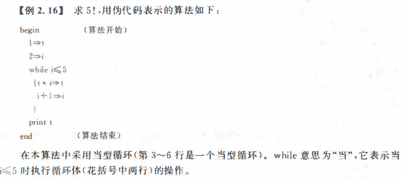

# 程序设计和c语言

## C 语言的结构

#### 一个程序由一个或多个源程序文件组成。 一个规模较小的程序，往往只包括一个 源程序文件，一个源程序文件中只有一个函数 (main函数）。

#### 在一个源程序文件中可以包括3个部分：

①预处理指令。如include <stdio. h> (还有一些其他预处理指令，如# define等）。

②全局声明：即在函数之外进行的数据声明。例如可以把例1.2程序中的"int a, b,sum;"放到main函数的前面．这就是全局声明，在函数外面声明的变量称为全局变量。如果是在程序开头（定义函数之前）声明的变量，则在整个源程序文件范围内有效。在函数中声明的变量是局部变量，只在函数范围内有效。

③函数定义。

#### 2.函数是C程序的主要组成部分

#### 3.一个函数包括两个部分。

①函数首部。 即函数的第1行，包括函数名、函数类型、函数属性、函数参数（形式参 数）名、参数类型。

②函数体。即函数首部下面的花括号内的部分。如果在一个函数中包括有多层花括号．则最外层的一对花括号是函数体的范围。

#### 4.程序总是从main函数开始执行的，而不论main函数在整个程序中的位置如何(main函数可以放在程序最前头，也可以放在程序最后，或在一函数之前、另一些函数之后）。

#### 5.程序中要求计算机的操作是由函数中的C语句完成的。如赋值、输入输出数据的操作都是由相应的C语句实现的。

#### 6.在每个数据声明和语句的最后必须有一个分号。分号是C语句的必要组成部分

#### 7. C语言本身不提供输入输出语句。

输入和输出的操作是由库函数scanf和printf
等函数来完成的。C语言对输入输出实行“函数化”。由千输入输出操作涉及具体的计算机
设备，把输入输出操作用库函数实现，就可以使C语言本身的规模较小，编译程序简单，很
容易在各种机器上实现，程序具有可移植性

#### 8.程序应当包含注释。 一个好的、有使用价值的源程序都应当加上必要的注释，以增加程序的可读性。

一个好的、有使用价值的源程序都应当加上必要的注释，以增加程序的可读性。


## 程序设计的任务

（1）问题分析

（2）设计算法

（3）编写程序

（4）对源程序进行编辑，编译和连接

（5）运行程序，分析结果

（6）编写程序文档

# 2.算法

## 程序=算法+数据结构

#### 一个程序主要包括以下两个方面的信息：

(1)对数据的描述。程序中要指定要用到哪些数据，以及这些数据的类型和数据的组织形式。这就是数据结构。

(2)对操作的描述。要求计算机进行的操作的步骤，也就是算法。

## 什么是算法

做任何事情都有一定的步骤。例如，你想从北京去天津开会，首先要去买火车票．然后按时乘坐地铁到北京站，登上火车，到天津站后坐汽车到会场．参加会议；要考大学，首先要填志愿表，交报名费，拿到准考证，按时参加考试，得到录取通知书，到指定学校报到注册等。这些步骤都是按一定的顺序进行的，缺一不可，次序错了也不行。从事各种工作和活动，都必须事先想好进行的步骤，然后按部就班地进行，才能避免产生错乱。实际上．在日常生活中，由千已养成习惯，所以人们并没意识到每件事都需要事先设计出“行动步骤”。例如吃饭、上学、打球和做作业等，事实上都是按照一定的规律进行的，只是人们不必每次都重复考虑它而已。

也就是解决问题的方法


## 算法的特性

（1）有穷性：一个算法应包含有限的操作步骤，而不能是无限的。

（2）确定性：算法中的每一个步骤都应当是确定的，而不应当是含糊的、模棱两可的。

（3） 有零个或多个输入：所谓输入是指在执行算法时需要从外界取得必要的信息。

（4）有一个或多个输出。算法的目的是为了求解，“解” 就是输出

（5）有效性。算法中的每一个步骤都应当能有效地执行，并得到确定的结果。


## 算法的表示

#### 1.用自然语言表示算法

用自然语言表示通俗易懂，但文字冗长，容易出现歧义。自然语言表 示的含义往往不大严格，要根据上下文才能判断其正确含义。例如有这样一句话：“张先生对李先生说他的孩子考上了大学＂，请问是张先生的孩子考上大学还是李先生的孩子考上大学呢？光从这句话本身难以判断。此外，用自然语言来描述包含分支和循环的算法不大方便（如 例2.5的算法）。因此，除了那些很简单的间题以外，一般不用自然语言表示算法。

#### 2.用流程图表示算法


#### 三种基本结构

（1）顺序结构

如图2. 14 所示，虚线框内是一个顺序结构。 其中 A 和 B 两个框是顺序
执行的。 即：在执行完A框所指定的操作后，必然接着执行B框所指定的操作。 顺序结构
是最简单的一种基本结构。

（2）选择结构

选择结构又称选取结构或分支结构，如图 2. 15 所示。 虚线框内是一个
选择结构。 此结构中必包含一个判断框。 根据给定的条件p是否成立而选择执行A框或B框。 例如p条件可以是x􀀜O或x>y,a+b<c+d等。

（3）循环结构

又称重复结构，即反复执行某一部分的操作。 有两类循环结构。

①当型(while型）循环结构。 当型循环结构如图2. 17(a) 所示。 它的作用是：当给定的条件pl成立时，执行A框操作，执行完A后，再判断条件pl是否成立，如果仍然成立，再执行A框，如此反复执行A框，直到某一次pl条件不成立为止，此时不执行A框，而从 b点脱离循环结构。
②直到型(until 型）循环结构。 直到烈循环结构如图 2.17(6)所示。 它的作用是：先执行A框，然后判断给定的p2条件是否成立，如果p2条件不成立，则再执行A,然后再对p2 条件作判断，如果p2条件仍然不成立，又执行A… …如此反复执行A, 直到给定的p2条件成立为止，此时不再执行A,从b点脱离本循环结构。


#### 用N-S流程图表示算法


#### 用伪代码表示算法

用传统的流程图和N-S图表示算法直观易懂，但画起来比较费事，在设计一个算法时， 可能要反复修改，而修改流程图是比较麻烦的。因此，流程图适千表示一个算法，但在设计 算法过程中使用不是很理想（尤其是当算法比较复杂、需要反复修改时）。为了设计算法时方便．常用一种称为伪代码(pseudo code)的工具。
伪代码是用介千自然语言和计算机语言之间的文字和符号来描述算法。它如同一篇文 章一样．自上而下地写下来。每一行（或几行）表示一个基本操作。它不用图形符号，因此书 写方便．格式紧凑．修改方便．容易看懂，也便千向计算机语言算法（即程序）过渡。
用伪代码写算法并无固定的、严格的语法规则，可以用英文，也可以中英文混用。只要把意思表达清楚．便于书写和阅读即可．书写的格式要写成清晰易读的形式。




#### 用计算机语言表示

用计算机语言表示算法必须严格遵循所用的语言的语法规则．这是和伪代码不同的． 下面将前面介绍过的算法用C语言表示。


#### 结构化程序设计方法

（1）自顶向下

（2）逐步细化

（3）模块化设计

（4）结构化编码


用这种方法逐步分解，直到作者认为可以直接将各小段表达为文字语句为止。 这种方法就叫做“ 自顶向下，逐步细化 ”。

序中的子模块一般不超过50行，即把它打印输出时不超过一页，这样的规模便于组织，也便千阅读。划分子模块时应注意模块的独立性，即使用一个模块完成一项功能，耦合
性愈少愈好。模块化设计的思想实际上是一种“分而治之”的思想，把一个大任务分为若干个子任务，每一个子任务就相对简单了。

结构化程序设计方法用来解决人脑思维能力的局限性和被处理问题的复杂性之间的矛盾。

在设计好一个结构化的算法之后，还要善于进行结构化编码 (coding) 。所谓编码就是将已设计好的算法用计算机语言来表示，即根据已经细化的算法正确地写出计算机程序。 结构化的语言（如 Pascal, C, Visual Basic 等）都有与 3 种基本结构对应的语句，进行结构化 编程序是不困难的。

# 3.常量和变量

#### 1.常量

（1）整型常量，如1000，121345，0，-12345

（2）实型常量

①十进制小数形式，有数字和小数点组成如123.456，0.345，-56.79，0.0

②指数形式如 12.34e3(12.34x10\*\*3)，-346.87e-25(-345.87x10\*\*-25)

（3）字符常量。有两种形式的字符常量：

①普通字符如：‘a’,'Z','3','?','#'

②转义字符


表3. 1中列出的字符称为转义字符，意思是将"\"后面的字符转换成另外的意义。 如 "\n"中的"n"不代表字母n而作为＂换行“符。
表 3. 1 中倒数第 2 行是一个以八进制数表示的字符，例如'\ 101'代表八进制数 101 的ASCII 字符，即A'(八进制数 101 相当千十进制数 65, 从附录 A 可以看到ASCII 码（十进制数）为 65 的字符是大写字母'A')。 1\012'代表八进制数 12(即十进制数的 10)的 ASCII 码所 对应的字符＂换行 “符。 表 3. 1 中倒数第 1 行是一个以十六进制数表示的 ASCII 字符，如 '\x411代表十六进制数 41 的 ASCII 字符，也是I A'(十六进制数 41 相当千十进制数 65)。用 表 3. 1 中的方法可以表示任何可显示的字母字符、数字字符、专用字符、图形字符和控制字 符。 如1\0331 或 1 \xlB1代表 ASCII 代码为 27 的字符，即 ESC 控制符。'\o' 或 1 \000'是代表ASCII 码为0的控制字符，即“空操作”字符，它常用在字符串中。

（4） 字符串常量。 如"boy" ,"123"等，用双撇号把若干个字符括起来，字符串常量是双撇号中的全部字符（但不包括双撇号本身）。注意不能错写成'CHINA勹boy','1231。单撇号内只能包含一个字符，双撇号内可以包含一个字符串。

（5） 符号常量。用# define 指令，指定用一个符号名称代表一个常量。如：

#### 2.变量


#### 3.常变量

C 99允许使用常变量，方法是在定义变量时，前面加一个关键字const, 如：

const int a=3; 

定义a为一个整型变量，指定其值为3而且在变量存在期间其值不能改变。
常变量与常量的异同是：常变量具有变量的基本属性：有类型，占存储单元，只是不允许改变其值。可以说·常变量是有名字的不变量，而常址是没有名字的不变值。 有名字就便于在程序中被引用。

符号常量Pi和常变量pi 都代表3. 1415926, 在程序中都能使用。但二者性质不同：定义符 号常量用# define指令，它是预编译指令，它只是用符号常量代表一个字符串，在预编译时仅进行字符替换，在预编译后，符号常量就不存在了（全置换成3. 1415926 了），对符号常量的名字是不分配存储单元的。而常变量要占用存储单元，有变量值，只是该值不改变而已。

从使用的角度看，常变最具有符号常量的优点，而且使用更方便。有了常变量以后，可以不必多用符号常量。


#### 4.标识符

在计算机高级语言中，用来对变量、符号常量名、函数、数组、类型等命名的有效字符序列统称为标识符(identifier)。简单地说，标识符就是一个对象的名字。 前面用到的变量名 pl,p2,c,f, 符号常量名PI,PRICE,函数名printf等都是标识符。

C语言规定标识符只能由字母、数字和下画线3种字符组成，且第1个字符必须为字母或下画线。 下面列出的是合法的标识符，可以作为变量名：

sum ,average. _total, Class, day, month, Student_name, lotus_ 1_2_3, BASIC, Ii_ ling。

下面是不合法的标识符和变量名：
M. D. John,¥123, # 33 .3D64,a>b

编译系统认为大写字母和小写字母是两个不同的字符。因此，sum和SUM是两个不同的变量名，同样，Class和class也是两个不同的变量名。一般而言，变量名用小写字母表示，与人们日常习惯一致，以提高可读性。

# 4.数据类型

C语言允许使用的类型见图3.4图中有*的是C99增加的。


其中，基本类型（包括整型和浮点型）和枚举类型变扯的值都是数值，统称为算术类型(arithmetic type)。算术类型和指针类型统称为纯量类型(scalartype) , 因为其变量的值是以数字来表示的。枚举类型是程序中用户定义的整数类型。数组类型和结构体类型统称为组合类型(aggregate type), 共用体类型不属千组合类型，因为在同一时间内只有一个成员具有值。函数类型用来定义函数，描述一个函数的接口，包括函数返回值的数据类型和参数的类型。

不同类型的数据在内存中占用的存储单元长度是不同的

## **有符号整数类型**


## **无符号整数类型**


## **浮点类型**


## 字符型

#### 字母 52个

```
大小写英文字母
```

#### 数字 10个

```
0-9
```

#### 符号 29个

```
！" # & ' ( ) * + , - . / : ; < = > ? [ \ ] ^ _ ` { | } ~
```

#### 空格符 5个

```
空格 tab（水平制表符） 垂直制表符 换行符 换页符
```

#### 不能显示的字符

```
空字符null（\0） 警告\a  退格符\b 回车\r
```

字符是以整数形式（ASCII码）来存储的

所有127个字符都可以使用7个二进制位表示

在c语言中使用一个字节来存储一个字符

也就是

| 进制     | 数值        |
| -------- | ----------- |
| 二进制   | 11 11 11 11 |
| 十六进制 | ff          |
| 十进制   | 255         |

但是！

计算机需要一位来表示符号（+/-）

0为+，1为－

因此

| 进制     | 数值                 |
| -------- | -------------------- |
| 二进制   | （符号位）1 11 11 11 |
| 十六进制 | 7f                   |
| 十进制   | 177                  |

因此ascii码无法表示中文

#### 字符变量

char只能表示ascii码中的字符

#### 因此占1字节

```
char c='?';//可以表示
char c='傅'//don't 表示
```

用法详见例题

前面说ascii码需要一位表示符号所以只有177个值

那肯定可以不表示符号表示255个值


## 浮点型

何为浮点？

具有小数点的实数

```c
float
double
long double
```


#### 如图，float占4字节为什么有效数字只有6，取值范围不是ff ff ff ff?

```
首先我们知道常用科学计数法是将所有的数字转换成(±)1.bx10^c的形式，其中a的范围是1到9共9个整数，b是小数点后的所有数字，c是10的指数。而计算机中存储的都是二进制数据，所以float存储的数字都要先转化成(±)1.bx2^c，由于二进制中最大的数字就是1，所以表示法可以写成(±)1.bx2^c的形式，float要想存储小数就只需要存储(±)，b和c就可以了。
```

float的存储正是将4字节32位划分为了3部分来分别存储正负号，小数部分和指数部分的：

Sign（1位）：用来表示浮点数是正数还是负数，0表示正数，1表示负数。
Exponent（8位）：指数部分。即上文提到数字c，但是这里不是直接存储c，为了同时表示正负指数以及他们的大小顺序，这里实际存储的是c+127。
Mantissa（23位）：尾数部分。也就是上文中提到的数字b。

#### 示例

float存储示例
以数字6.5为例，看一下这个数字是怎么存储在float变量中的：

1.先来看整数部分，模2求余可以得到二进制表示为110。（直接转二进制）

2.再来看小数部分，乘2取整可以得到二进制表示为.1（如果你不知道怎样求小数的二进制，请主动搜索一下）。

3.拼接在一起得到110.1然后写成类似于科学计数法的样子，得到1.101 x 2^2

4.从上面的公式中可以知道符号为正，尾数是101，指数是2。

5.符号为正，那么第一位填0，指数是2，加上偏移量127等于129，二进制表示为10000001，填到2-9位，剩下的尾数101填到尾数位上即可


符号：0正1负

指数：指数加127

因此表示范围-127-0-128

尾数：

22位二进制

3f ffff

表示尾数需要转换二进制

便需要将小数表示二进制

```
10.6
1.整数部分10=1010
2.小数部分0.6=10011(0.6×2取整数部分，以此类推)
特殊情况： 小数部分出现循环，无法停止，则用有限的二进制位无法准确表示一个小数，这也是在编程语言中表示小数会出现误差的原因
0.6 * 2 = 1.2 ——————- 1
0.2 * 2 = 0.4 ——————- 0
0.4 * 2 = 0.8 ——————- 0
0.8 * 2 = 1.6 ——————- 1
0.6 * 2 = 1.2 ——————- 1
```

因此6.5=01101

表示110.1

写成类似科学计数法的样子

小数点前进几位指数就是几,本此前进两位所以是^2

1.101x2^2

| 符号 | E指数 | E    | E    | E    | E    | E    | E    | E    | M尾数 | M    | M    | M    | M    | M    | M    | M    | M    | M    | M    | M    | M    | M    | M    | M    | M    | M    | M    | M    | M    | M    | M    |
| ---- | ----- | ---- | ---- | ---- | ---- | ---- | ---- | ---- | ----- | ---- | ---- | ---- | ---- | ---- | ---- | ---- | ---- | ---- | ---- | ---- | ---- | ---- | ---- | ---- | ---- | ---- | ---- | ---- | ---- | ---- | ---- |
| 0    | 1     | 0    | 0    | 0    | 0    | 0    | 0    | 1    | 1     | 0    | 1    | 0    | 0    | 0    | 0    | 0    | 0    | 0    | 0    | 0    | 0    | 0    | 0    | 0    | 0    | 0    | 0    | 0    | 0    | 0    | 0    |

#### float范围

明白了上面的原理就可求float类型的范围了，找到所能表示的最大值，然后将符号为置为1变成负数就是最小值，要想表示的值最大肯定是尾数最大并且指数最大，
那么可以得到尾数为 0.1111111 11111111 11111111，指数为 11111111，但是指数全为1时有其特殊用途，所以指数最大为 11111110，指数减去127得到127，所以最大的数字就是1.1111111 1111111 11111111 x 2^127(1.1111111 1111111 11111111x10^127) ，这个值为 340282346638528859811704183484516925440，通常表示成 3.4028235E38，那么float的范围就出来了：

[-3.4028235E38, 3.4028235E38]

#### float精度

说结果就是8位


#### 然而整了那么久，其实c标准并无具体规定究竟用多少位来表示小数部分，多少位来表示指数部分，由各c语言编译系统来决定，重要的是掌握方法。


#### double型（双精度浮点型）

double比float更能存，他占用8个字节，可以表示15个有效数字

#### long double型（长双精度型）

long double比float更更能存，比float更能存，更long，所以他占用16个字节，可以表示19个有效数字


#### 整型常量

整型常量被分配2个字节，其范围是（+/-）65535/2也就是-32768-63767，如果超出这个范围，系统会把它最为长整型long int来处理，分配4个字节。在Visual C++中，-2147483648-2147483647范围内的不带小数点的数都为int型，再此范围外又在long long范围的数，作为long long型处理

在一个整数末尾加大小写L,表示为长整型

#### 浮点型常量

凡是以小数形式或指数形式出现的均是浮点型常量，在内存中都以指数形式存储。10是整型，10.0是浮点型

# 5.运算符

## 算数运算符 7个

| +                        | -                        | +          | -          | *          | /          | %          |
| ------------------------ | ------------------------ | ---------- | ---------- | ---------- | ---------- | ---------- |
| 正号运算符（单目运算符） | 负号运算符（单目运算符） | 加法运算符 | 减法运算符 | 乘法运算符 | 除法运算符 | 求余运算符 |


## 自增 自减运算符 2个

```C
a=1;
printf("%d",a++);//输出1
printf("%d",++a);//输出3
printf("%d",a--);//输出3
printf("%d",--a);//输出1
```

简简单单，不多bb

#### 一些优先级

c语言中一样遵守数学中的优先级（不会的滚回小学找个同学教你）

简简单单不多bb


## 关系运算符

| >      | <      | ==     | >=         | <=         | !=       |
| ------ | ------ | ------ | ---------- | ---------- | -------- |
| 大于号 | 小于号 | 等于号 | 大于等于号 | 小于等于号 | 不等于号 |

## 逻辑运算符

| !      | &&     | \|\|   |
| ------ | ------ | ------ |
| 逻辑非 | 逻辑与 | 逻辑或 |

## 位运算符

| <<   | >>   | ~    | \|   | ^    | &    |
| ---- | ---- | ---- | ---- | ---- | ---- |
|      |      |      |      |      |      |

赋值运算符号

| =      |
| ------ |
| 赋值符 |

## 条件运算符

| ?=         |
| ---------- |
| 条件运算符 |

## 逗号运算符

| ，         |
| ---------- |
| 逗号运算符 |

## 指针运算符

| &              | *                                        |
| -------------- | ---------------------------------------- |
| 获取地址的符号 | 获取地址的值的符号也是定义指针变量的符号 |

## 求字节数运算符

| sizeof         |
| -------------- |
| 求字节数运算符 |

## 强制类型转换运算符

| （类型）           |
| ------------------ |
| 强制类型转换运算符 |

## 下标运算符

| [ ]        |
| ---------- |
| 下标运算符 |


# 6.运算符优先级

## 一个表达式可以包含多个运算符，既然如此便有优先级

```c
+ - 优先级小于* / %//小学知识
```

```c
 a=b=c //赋值号优先级从右向左
```

 

## && 和 ||

&& 和 || 是逻辑运算符，分别是逻辑与(&&)和逻辑或(||)

1) && (逻辑与)：(三种)
① **当逻辑与左边为false(假)**，**则不再进行逻辑与右边的判断**，结果为false(假)
② 当逻辑与左边为true(真)则进行右边判断，右边为false(假)，结果为false(假)
③ 当逻辑与左边为true(真)则进行右边判断，右边也为true(真)，则结果为true(真)
2) || (逻辑或)：(三种)
① 当逻辑或左边为false(假)，继续逻辑或右边的判断，如果也为false(假)，结果为false(假)
② 当逻辑或左边为false(假)，继续逻辑或右边的判断，如果为true(真)，结果为true(真)
③ **当逻辑或左边为true(真)**，**则不再进行逻辑或右边的判断**，结果为true(真)

```C
#include  <stido.h>

void main() 
{
    int x = 2, y = 2, z = 0, a;
    a = ++x || ++y && z++;
    printf("%d,%d,%d", x, y, z);
}
```

求x,y,z


解析如下：


```c
a = ++x || (++y && z++);
```

或运算当左侧不为0时，不运算右边，所以

```c
(++y && z++)
```

没有进行运算

所以并没有自增运算

所以

运行结果

```
3,2,0
```

所以与和或的优先级不同其他优先级运算

当与和或同时出现在一个表达式中，并不会改变从左往右的运算顺序

而是往与表达式那加上一个括号，而或运算有短路效果，当或在左侧时，且或左侧的表达式不满足0，则不会运行右侧的表达式。


# 表达式

用**算数运算符**和**括号**将**运算对象**（也称操作数）连接起来的、符合c语法规则的式子称为**C算数表达式**


c语言规定了运算符的优先级（例如先乘除后加减），还规定了运算符的**结合性**


### 不同类型数据的混合运算

int  与 float运算结果总是float类型

float 与 double运算总是double类型

运算结果总是较为精确的类型

char 与int进行运算会使用ascii码与整型一起计算

```c
12+'A'
=
12+65
```

## 


# #

# #

# #

# #

# #

# #

# #

# #

# #

# #

# 指针

#### 指针变量的定义

```c
int *pa;
```

定义了一个整型指针变量 pa，该指针变量只能指向基类型为 int 的整型变量，即只能保存整型变量的地址。

说明：

1) *号标识该变量为指针类型，当定义多个指针变量时，在每个指针变量名前面均需要加一个 *，不能省略，否则为非指针变量。例如：

```c
int *pa,*pb;
```

表示定义了两个指针变量 pa、pb。而：

int *pa,pb;

则仅有 pa 是指针变量，而 pb 是整型变量。

```c
int *pi,a,b; //等价于inta,b,*pi;
```

表示定义了一个整型指针变量 pi 和两个整型变量 a 和 b。

2) 在使用已定义好的指针变量时，在变量名前面不能加 *。例如：

```c
int *p,a;*p=&a; //错误，指针变量是p而不是*p
```

而如下语句是正确的。

```c
int a,*p=&a; //正确
```

该语句貌似把 &a 赋给了 *p，而实际上 p 前的 * 仅是定义指针变量 p 的标识，仍然是把 &a 赋给了 p，故是正确的赋值语句。

3) 类型为该指针变量所指向的基类型，可以为 int、char、float 等基本数据类型，也可以为自定义数据类型。

该指针变量中只能保存该基类型变量的地址。

假设有如下变量定义语句：

```c
int a,b,*pa,*pb;char *pc,c;
```

则：

```c
pa=&a;//正确。pa基类型为int，a为int型变量，类型一致pb=&c;//错误。pb基类型为int，c为char型变量，类型不一致pc=&c;//正确。pc基类型为char,c为char型变量，类型一致*pa=&a;//错误。指针变量是pa而非*pa
```

4) 变量名是一合法标识符，为与普通变量相区分，一般指针变量名以字母 p(pointer)开头，如 pa、pb 等。

5) 由于是变量，故指针变量的值可以改变，也即可以改变指针变量的指向。

```c
char c1,*pc,c2;//定义了字符变量c1、c2和字符指针变量pc
```

则如下对指针变量的赋值语句均是正确的。

```c
pc=&c1; //pc指向c1pc=&c2; //pc不再指向c1，而指向c2
```

6) 同类型的指针变量可以相互赋值。

```c
int a,*p1,*p2,b;//定义了两个整型变量a,b;两个整型指针变量为p1,p2float *pf;
```

以下赋值语句均是正确的。

```c
p1=&a; //地址箱p1中保存a的地址，即p1指向ap2=p1; //p2也指向a，即p1和p2均指向a
```

上述最后一条赋值语句相当于把地址箱 p1 中的值赋给地址箱 p2，即 p2 中也保存 a 的地址，即和 p1 —样，p2 也指向变量 a。

以下赋值语句均是错误的。

```c
pf=p1； //错误。p1,pf虽然都是指针变量，但类型不同，不能赋值pf=&b; //错误。指针变量pf的基类型为float，b类型为int,不相同
```

由于指针变量是专门保存地址值（指针）的变量，故本节把指针变量形象地看成“地址箱”。

设有如下定义语句：

```c
int a=3,*pa=&a; //pa保存变量a的地址，即指向achar c='d',*pc=&c; //pc保存变量c的地址，即指向c
```

把整型变量 a 的地址赋给地址箱 pa，即 pa 指向变量 a，同理 pc 指向变量 c，如图 2 所示。


图 2 指针指向变量


#### **指针变量的引用**

访问内存空间，一般分为直接访问和间接访问。

如果知道内存空间的名字，可通过名字访问该空间，称为直接访问。由于变量即代表有名字的内存单元，故通。过变量名操作变量，也就是通过名字直接访问该变量对应的内存单元。

如果知道内存空间的地址，也可以通过该地址间接访问该空间。对内存空间的访问操作一般指的是存、取操作，即向内存空间中存入数据和从内存空间中读取数据。

在 C 语言中，可以使用间接访问符（取内容访问符）*来访问指针所指向的空间。

例如：

```c
纯文本复制
int *p,a=3;//p中保存变量a对应内存单元的地址p=&a;
```

在该地址 p 前面加上间接访问符 *，即代表该地址对应的内存单元。而变量 a 也对应该内存单元，故 *p 就相当于 a。

```c
纯文本复制
printf("a=%d\n",a); //通过名字，直接访问变量a空间（读取)printf("a=%d\n",*p); //通过地址，间接访问变量a空间（读取）*p=6;//等价于a=6;间接访问a对应空间（存）
```

#### “野”指针

本节中，把没有合法指向的指针称为“野”指针。因为“野”指针随机指向一块空间，该空间中存储的可能是其他程序的数据甚至是系统数据，故不能对“野”指针所指向的空间进行存取操作，否则轻者会引起程序崩溃，严重的可能导致整个系统崩溃。

例如：

```c
int *pi,a; //pi未初始化，无合法指向，为“野”指针
*pi=3; //运行时错误！不能对”野”指针指向的空间做存入操作。该语句试图把 3 存入“野”指针pi所指的随机空间中，会产生运行时错误。
a=*pi; //运行时错误！不能对”野”指针指向的空间取操作。该语句试图从“野”指针pi所指的空间中取出数据，然后赋给变量a同样会产生运行时错误。
```

正确的使用方法：

```c
pi=&a;//让pi有合法的指向，pi指向a变量对应的空间
*pi=3;//把3间接存入pi所指向的变量a对应的空间
```

#### 数组与指针

数组是一系列相同类型变量的集合，不管是一维数组还是多维数组其存储结构都是顺序存储形式，即数组中的元素是按一定顺序依次存放在内存中的一块连续的内存空间中(地址连续）。

指针变量类似于一个地址箱，让其初始化为某个数组元素的地址，以该地址值为基准，通过向前或向后改变地址箱中的地址值，即可让该指针变量指向不同的数组元素，从而达到通过指针变量便可以方便地访问数组中各元素的目的。

#### 一维教组和指针

在 C 语言中，指针变量加 1 表示跳过该指针变量对应的基类型所占字节数大小的空间。指向数组元素的指针，其基类型为数组元素类型，指针加 1 表示跳过一个数组元素空间，指向下一个数组元素。

例如：

```c
int *p,a[10];p=a; //相当于 p=&a[0];
```

说明：数组名 a 相当于数组首元素 a[0] 的地址，即 a 等价于 &a[0]。

上述语句定义了整型指针变量 p 和整型数组 a，并使 p 初始指向数组首元素 a[0]。 当指针变量和数组元素建立联系后，可通过以下三种方式访问数组元素。

1) 直接访问：数组名[下标]; 的形式。如 a[3]。

2) 间接访问：*(数组名+i); 的形式。其中，i 为整数，其范围为：0<i<N，N 为数组大小。数组名 a 为首元素的地址，是地址常量，a+i 表示跳过 i 个数据元素的存储空间，即(a+i)表示 a[i] 元素的地址，从而 *(a+i) 表示 a[i]。

如果指针变量 p 被初始化为 a 之后，不再改变，那么也可以使用 *(p + i) 的形式访问 a[i]，不过这样就失去了使用指针变量访问数组元素的意义。

3) 间接访问：*(指针变量)；的形式。当执行语句 p=a; 后，可以通过改变 p 自身的值（可通过自增、自减运算），从而使得 p 中保存不同的数组元素的地址，进而通过 *p 访问该数组中不同的元素。这是使用指针访问数组元素较常用的形式。例如，如下代码通过使用指针变量的移动来遍历输出数组中的每个元素。

```c
for (p=a;p<a+N;p++) //用p的移动范围控制循环次数
    printf ("%d\t",*p);
```

确定 p 指针移动的起止地址，即循环控制表达式的确定是使用指针访问数组元素的关键。

p 初始指向 a[0]，即 p=&a[0]; 或 p=a;。
p 终止指向 a[N-1]，即 p=&a[N-l]; 或 p=a+N-1;。

故可得 p 的移动范围为：p>=a && p<=a+N-1;，而 p<=a+N-1 通常写成 p<a+N;，由此可得循环条件为：for (p=a;p<a+N;p++)。

数组名 a 和指针变量 p 的使用说明如下。有如下代码：

```c
int *p,a[10],i;
p=a;
```

1) 执行p=a; 后，*(a+i) 与 *(p+i) 等价，均表示 a[i]。

2) p[i] 与 a[i] 等价。a 为地址值，可采用 a[i] 形式访问数组元素，而 p 也为地址值，故也可采用 p[i] 形式访问数组元素。

3) a 为常量地址，其值不能改变，故 a++; 语法错误。而 p 为变量，其自身的值可以改变，故 p++; 正确。

**【例 1】**通过指针变量实现对数组元素的输入和输出操作。

实现代码为：

```c
#include <stdio.h>
#define N 10
int main (void){
int *p,a[N],i;
p=a; //p初始指向a[0]    
printf("Input the array:\n");    
for(i=0;i<N;i++) //用整型变量i控制循环次数        
    scanf ("%d",p++); //指针P表示地址，不能写成&P   
printf ("the array is :\n");    
for(p=a;p<a+N;p++) //用p的移动范围控制循环次数        
    printf("%d\t", *p);    
return 0;
}
```

补充说明：
输入输出循环控制方法有多种，不管采用哪种，必须准确确定起点和终点的表达式。

1) 输入若采用p的移动范围确定循环次数，则代码如下。

```c
for(p=a;p<a+N;p++)    scanf("%d",p);
```

这时，for 语句之前的 p=a; 语句可以去掉。

2) 输出若采用移动指针变量 p 控制循环的执行，因为执行完输入操作后，p 已不再指向数组首元素，而是越界的 a[N] 初始位置，故必须重新给 p 赋值，让其指向数组的首元素， 代码如下。

```c
p=a; //重新赋值，让p指向数组首元素for(i=0;i<N;i++)    printf ("%d\t",*p++);
```

指针值加 1 与地址值加 1 的区别如下。

一般地址单元也称内存单元，是按字节划分的，即地址值加 1，表示跳过一个字节的内存空间。

在 C 语言中，指针变量加 1 表示跳过该指针变量对应基类型所占字节数大小的空间。

在 VC++ 6.0 中，整型占 4 个字节，故对于整型指针变量来说，指针值加 1 对应地址值加 4，即跳过 4 个字节；字符型占 1 个字节，故字符型指针变量加 1，对应地址值也加 1，即跳过 1 个字节。double 型占 8 个字节，故 double 型指针变量加 1，对应地址值加 8，即跳过 8 个字节等。

#### 二维数组和指针

#### 数组指针

数组指针，即指向一维数组的指针。

数组指针的定义格式为：

类型 (*指针名)[N]; //N元素个数

数组指针是指向含 N 个元素的一维数组的指针。由于二维数组每一行均是一维数组，故通常使用指向一维数组的指针指向二维数组的每一行。例如：

```c
int (*p)[5];
```

上述语句表示定义了一个指向一维数组的指针 p，或者简称为一维数组指针 p，该指针 p 只能指向含 5 个元素的整型数组。

在定义数组指针时，如果漏写括号 ()，即误写成如下定义形式：

```c
int *p[5];
```

由于下标运算符 [] 比 * 运算符的优先级髙，p 首先与下标运算符 [] 相结合，说明 p 为数组，该数组中有 5 个元素，每个为 int * 型。即 p 为指针数组。

二维数组 a[M][N] 分解为一维数组元素 a[0]、a[1]、…、a[M-1] 之后，其每一行 a[i] 均是一个含 N 个元素的一维数组。如果使用指向一维数组的指针来指向二维数组的每一行，通过该指针可以较方便地访问二维数组中的元素。

使用数组指针访问二维数组中的元素。

例如：

```c
#define M 3#define N 4int a[M][N],i,j;int (*p)[N]=a; // 等价于两条语句 int (*p)[N] ; p=a;
```

以上语句定义了 M 行 N 列的二维整型数组 a 及指向一维数组（大小为 N）的指针变量 p，并初始化为二维数组名 a，即初始指向二维数组的 0 行。

i 行首地址与 i 行首元素地址的区别如下。

- i 行首元素的地址，是相对于 i 行首元素 a[i][0] 来说的，把这种具体元素的地址，称为一级地址或一级指针，其值加 1表 示跳过一个数组元素，即变为 a[i][1] 的地址。
- i 行首地址是相对于 i 行这一整行来说的，不是具体某个元素的地址，是二级地址，其值加 1 表示跳过 1 行元素对应的空间。
- 对二级指针（某行的地址）做取内容操作即变成一级指针（某行首元素的地址）。


两者的变换关系为：

*(i 行首地址)=i 行首元素地址

0 行首地址：p + 0 <--> a + 0
1 行首地址：p + 1 <--> a + 1
...
i 行首地址：p + i <--> a + i

i 行 0 列元素地址：*(p + i) +0 <—> *(a + i) +0 <—>&a[i][0]
i 行 1 列元素地址：* (p + i) +1 <--> *(a + i) +1 <—>&a[i][1]
...
i 行 j 列元素地址：* (p + i) + j <--> * (a + i) + j <--> &a[i][j]
i 行 j 列对应元素：* (* (p + i) + j) <--> * (* (a + i) + j) <--> a[i][j]

由此可见，当定义一个指向一维数组的指针 p，并初始化为二维数组名 a 时，即 p=a;， 用该指针访问元素 a[i][j] 的两种形式 *(*(p + i) + j) 与 *(*(a + i) + j) 非常相似，仅把 a 替换成了 p 而已。

由于数组指针指向的是一整行，故数组指针每加 1 表示跳过一行，而二维字符数组中每一行均代表一个串，因此在二维字符数组中运用数组指针能较便捷地对各个串进行操作。

#### 指针数组

指针数组，即存储指针的数组，数组中的每个元素均是同类型的指针。

指针数组的定义格式为：

类型 *数组名[数组大小];

例如，如下语句定义了一个含有 5 个整型指针变量的一维数组。

```c
int * a[5];
```

数组 a 中含有 5 个元素，每个元素均是整型指针类型。

可以分别为数组的各个元素赋值，例如：

```c
int a0,a1,a2,a3,a4;a[0]=&a0;a[1]=&a1;...a[4]=&a4;
```

也可以使用循环语句把另一个数组中每个元素的地址赋给指针数组的每个元素。例如：

```c
int i,*a[5],b[]={1,2,3,4,5};for(i=0;i<5;i++)    a[i]=&b[i];
```

这样指针数组 a 中每个元素 a[i] 中的值，均为 b 数组对应各元素的地址 &b[i]，即整型指针。由于 a[i]=&b[i]，两边同时加取内容运算符 *，即 *a[i]=*&b[i]=b[i]，即通过指针数组中的每个元素 a[i] 可间接访问 b 数组。如下程序可以输出 b 数组中的所有元素。

```c
for(i=0;i<5;i++)    printf ("%d\t",*a[i]) ; //*a[i]=b[i]
```

指针数组最主要的用途是处理字符串。在 C 语言中，一个字符串常量代表返回该字符串首字符的地址，即指向该字符串首字符的指针常量，而指针数组的每个元素均是指针变量，故可以把若干字符串常量作为字符指针数组的每个元素。通过操作指针数组的元素间接访问各个元素对应的字符串。例如：

```c
char * c[4]={"if","else","for","while"};int i;for (i=0;i<4;i++) //需确定数组元素个数puts (c[i]) ; //输出c[i]所指字符串
```

上述方法需要知道数组元素个数即该数组中字符串的个数。更通常的做法是，在字符指针数组的最后一个元素（字符串）的后面存一个 NULL 值。NULL 不是 C 语言的关键字，在 C 语言中 NULL 为宏定义：

```c
#define NULL ( (void*) 0)
```

NULL 在多个头文件中均有定义，如 stdlib.h、stdio.h、string.h、stddef.h等。只要包含上述某个头文件，均可以使用 NULL。

上述语句可以修改为：

```c
char *c[] = {"if","else","for", "while", NULL};int i;for (i=0;c[i]!=NULL;i++) //NULL 代替使用数组大小    puts (c[i]);
```


## 指针与字符串

#### 常量字符串与指针

**1)** 字符串与字符指针常量

字符串常量返回的是一个字符指针常量，该字符指针常量中保存的是该字符串首字符的地址，即指向字符串中第一个字符的指针。

例如，字符串常量 "abcd" 表示一个指针，该指针指向字符 'a'，表达式 "abcd"+1，是在指针 "abcd" 值的基础上加 1，故也是一个指针，指向字符串中第二个字符的指针常量。同理，"abcd"+3 表示指向第 4 个字符 'd' 的指针常量。

由于 "abcd"+1 表示指向字符 'b' 的指针常量，即保存 'b' 的地址，故如下两条语句均是输出从该指针地址开始直到遇到字符串结束符 '\0' 为止的字符串 "bcd"。

```c
puts("abcd"+1);
```

等价于

```c
printf ("%s\n","abcd"+1);
```

既然字符串返回指针，那么通过间接访问符 *，可以访问该指针所指向的字符，例如： *("abcd”+1) 表示字符 'b'； *("abcd"+3) 表示字符 'd'； *("abcd"+4) 表示空字符 '\0'； *("abcd"+5) 已越界，表示的字符不确定。

所以，以下两条语句均输出字符 'c'。

```c
putchar (*("abcd"+2)) ; //输出字符printf ("%c",*("abcd"+2) ) ;//输出字符'c'
```

以下语句输出空字符（字符串结束符）。

```c
putchar (*("abcd"+4)) ; //输出字符串结束符空字符
```

由于 "abcd"+5 表示的指针已超出字符串存储空间，该指针指向的内容 *("abcd"+5) 不确定。

```c
putchar (*("abcd"+5)) ; //禁止使用。其值不确定
```

当字符数组名用于表达式时也是作为字符指针常量的，例如：

```c
char c[]="xyz";
```

数组名 c 为指针常量，即字符的地址，故 c+1 为字符 'y' 的地址，故如下语句输出 yz。

```c
puts(c+1); //输出yz并换行
```

字符串和字符数组名均表示指针常量，其本身的值不能修改。如下语句均是错误的。

```c
c++； //错误。字符数组名c为常量"xyz"++; //错误。字符串表示指针常量，其值不能修改*("xyz"+1)='d'; //运行时错误。试图把y，变为W
```


**2)** 字符串与字符指针变量

在 C 语言中，经常定义一个字符指针变量指向一个字符串，例如：

```c
char *pc="abcd";
```

定义了一个字符指针变量 pc，并初始化为字符串 ”abcd”，即初始指向字符串的首字符，pc=pc+1; 表示向后移动一个字符单元，pc 保存字符 'b' 的地址，即指向字符 1。通过每次使 pc 增 1，可以遍历字符串中的每个字符。

例如，如下代码段通过指针变量依次遍历输出所指串中每个字符。

程序代码为:

```c
#include<stdio.h>int main (void){    //初始指向首字符    //间接访问所指字符 //pc依次指向后面的字符    char *pc="hello,world!";    while (*pc! = '\0')    {        putchar(*pc);        pc++;}    return 0;}
```

通过字符指针变量可访问所指向的字符串常量，但仅限于“读取”操作，也可以修改字符指针变量的指向，即让其重新指向其他字符串；但不能进行“修改”操作，即不能通过该指针变量，企图改变所指向字符串的内容。有些编译器在编译时可能不报错，但运行时会发生错误。例如：

```c
char *pc; //正确，未初始化，随机指向
```

该语句定义了一个字符指针变量，并未显式初始化，属于“野”指针，不能对该指针所指内容进行存取操作。由于 pc 为变量，故可以修改指针的指向，即可以让指针变量 pc 重新指向其他字符串。故如下操作是正确的。

```c
pc="abcd"; //正确，让 pc 指向串 "abcd"pc="hello"; //正确，修改pc指向，让其指向串"hello"
```

此时，字符指针变量 pc 已指向字符串常量 "hello”，不能通过指针修改该字符串常量。 如下操作是错误的。

```c
*(pc+4) = 'p'; //运行时错误。试图把'o'字符改变为'p'
```

更不允许企图通过 pc 指针，覆盖其所指字符串常量。如下企图使用 Strcpy 把 "xyz" 串复制并覆盖 pc 所指串 "hello”。

```c
strcpy(pc,"xyz");//运行时错误。企图把另一个串复制到pc空间
```

#### 变量字符串

字符数组可以理解为若干个字符变量的集合，如果一个字符串存放在字符数组中，那么字符串中的每个字符都相当于变量，故该字符串中的每个字符均可以改变，故可把存放在字符数组中的字符串称为变量字符串。

\1) 字符数组空间分配 例如：

```c
char str[10]="like";
```

定义了一个字符数组并显式指定其大小是 10（数组空间应足够大，一般大于等于字符串长度 +1），即占 10 个字符空间，前 5 个空间分别存放有效字符 'l'，'i'，'k'，'e' 及结束符 '\0'，多余的空间均用 '\0' 填充。

定义时也可以不显式指定其大小，让编译器根据初始化字符串长度加 1 来自动分配空间大小。例如：

```c
char s[]="like";
```

编译器为该数组分配 5 个字符空间大小，前 4 个为有效字符第 5 个为结束符 '\0'。

\2) 访问字符数组元素

使用数组下标的形式可以逐个改变数组中的每个元素，如下所示。

```c
s[1]=*o'; //正确。s[2] ='v';; //正确。'k'->'v'puts (s); //输出love并换行
```

可以把字符数组和字符指针联合使用，如下所示。

```c
char str[]='I Like C Language!";char *ps=str;//初始指向字符串首字符"I"*(ps+3)='o';//'i'->'o'*(ps+4)='v';//'k'->'v'ps=str+2;//ps指向'L'字符puts (ps);//输出 Love C Language!并换行
```


\3) 字符数组访问越界

不管采用数组名加下标形式还是使用字符指针变量访问字符串，一定不能越界。否则可能会产生意想不到的结果，甚至程序崩溃。如下操作均是错误的。

```c
char c[]="Nan Jing", *pc=c+4; //c 大小：9，pc 指向'J'c[10] ='!'; //错误。没有c[10]元素，越界存储，编译器不检查数组是否越界*(pc+6)='!'; //错误。越界存，pc+6 等价于 c[10]putchar (c[9]) ; //错误，越界取，值不确定
```


\4) 字符串结束符

一般把字符串存放于字符数组中时，一定要存储字符串结束符 '\0'，因为 C 库函数中，对字符串处理的函数，几乎都是把 '\0' 作为字符串结束标志的。如果字符数组中没有存储结束符，却使用了字符串处理函数，因为这些函数会寻找结束符 '\0'，可能会产生意想不到的结果，甚至程序崩溃。例如：

```c
char s1[5]="hello"; //s1不含'\0'char s2[] = {'w','o','r','l','d'}; //s2大小:5，不含'\0'char s3[5]; //未初始化，5个空间全为不确定值s3[0] = 'g';s3[1]='o';
```

s3 数组的前两个空间被赋值为 'g' 和 'o'，未被显式赋值的 s3[2]、s3[3]、s3[4] 依然为不确定值。即 s3 数组中依然不含有字符串结束符 '\0'。s3 数组各元素如下所示（'?'表示不确定值）。


| s3[0] | s3[1] | s3[2] | s3[3] | s3[4] |
| ----- | ----- | ----- | ----- | ----- |
| g     | o     | ?     | ?     | ?     |


故以下操作语句严格来说均是错误的，是被禁止的操作。

```c
puts(s2); //s2中不含'\0'，输出不确定值，甚至程序崩溃.strcpy (s1, s3) ; //运行时错误。s3中找不到结束符'\0'
```

注意 s3 数组与如下 s4 数组的区别。

```c
char s4[5] = {'g','o'}；
```

s4 数组中有 5 个元素，初始化列表中显式提供了两个字符 'g' 和 'o'，其他元素使用字符的默认值：空字符，即结束符 '\0'。s4 数组各元素如下所示。


| s4[0] | s4[1] | s4[2] | s4[3] | s4[4] |
| ----- | ----- | ----- | ----- | ----- |
| g     | o     | \0    | \0    | \0    |


故对 s4 数组的如下操作语句均是正确的。

```c
puts (s4); //输出go并换行strcpy (s1,s4) ; //把 s4 中的串 go 和一个'\o'复制到 s1 中。
```

执行上述语句后，s1 数组中各元素如下所示。


| s1[0] | s1[1] | s1[2] | s1[3] | s1[4] |
| ----- | ----- | ----- | ----- | ----- |
| g     | o     | \0    | 1     | o     |


此时，s1 数组中也含有字符串结束符。可以调用字符串处理函数（第一次遇到 '\0' 表示一个串结束），如下所示。

```c
int len=strlen (s1) ; // 正确，len 为 2puts (s1); //正确，输出go并换行
```


\5) 通过字符指针修改变量字符串

通过字符指针变量可以访问所指字符数组中保存的串，不仅可以读取该数组中保存的字符串，还可以修改该串的内容。原因从数组的本质上理解：数组是一系列相同类型变量的集合，故其中保存的字符串，可以理解为是由若干个字符变量组成的。每个字符变量当然可以改变。

例如：

```c
#include<stdio.h>
#include<string.h>
int main (void)
{    
    char str[30]="Learn and live.",*p=str;    
    *(p+6)='A';    
    *(p+10)='L';    
    puts(str);    
    return 0;
}
```

该程序中，字符指针 p 指向数组 str 中的字符串，由于该字符串是由一系列字符变量组成的，故通过指针变量 p 可以改变该字符串中的字符。故该程序输出：Learn And Live.。